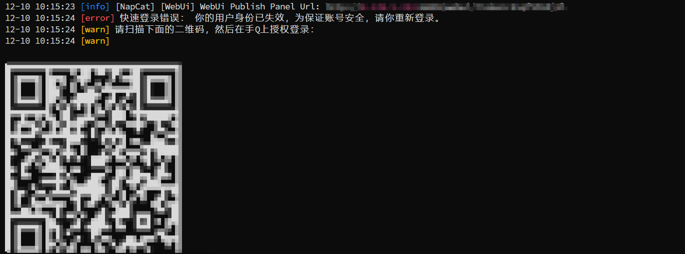
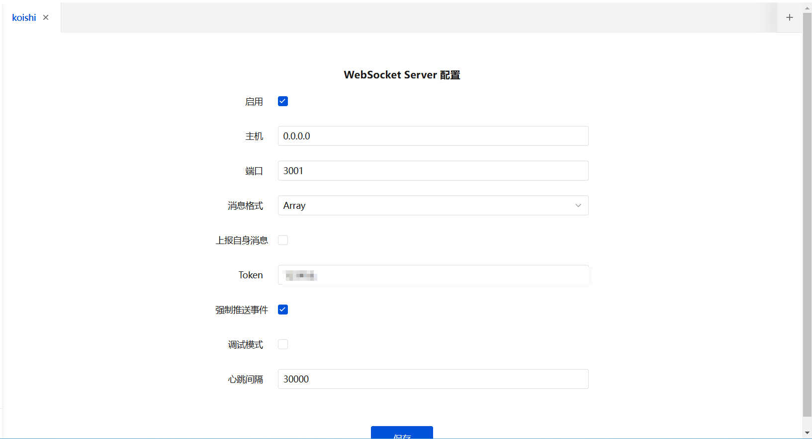
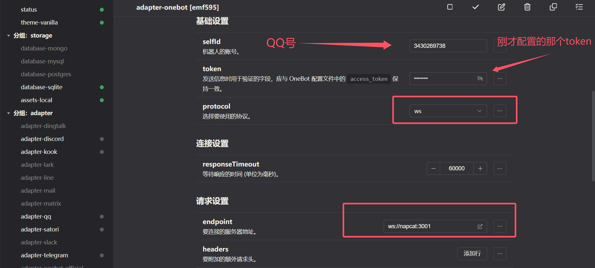

# Bot

## 简介
使用koishi和napcat制作一个QQ Bot

## 特性

### 开箱即用

koishi 提供了高度便利的控制台，让你无需基础让你在几分钟之内搭建自己的聊天机器人。

- 提供在线插件市场，即使没有任何编程基础，也能轻松在控制台中下载安装插件
- 支持 QQ，Telegram，Discord，飞书等主流聊天平台，支持多账户和跨平台数据互通
- 随时随地通过控制面板监控运行状态，控制机器人的行为，甚至上号聊天

## 安装（在容器中运行）

1. 创建docker-compose.yml

   ```
   services:
     koishi:
       image: koishijs/koishi
       container_name: koishi
       environment:
         - TZ=Asia/Shanghai
       ports:
         - 5140:5140
       volumes:
         - ./koishi:/koishi
       restart: always
     napcat:
       image: mlikiowa/napcat-docker:latest
       container_name: napcat
       environment:
         - NAPCAT_GID=1000
         - NAPCAT_UID=1000
       ports:
         - 3000:3000
         - 3001:3001
         - 6099:6099
       volumes:
         - /opt/napcat/config:/app/napcat/config
         - /opt/napcat/QQ:/app/.config/QQ
       restart: always
   ```

## 使用方法

1. 启动项目：
   ```bash
   docker compose up
   ```

2. 查看容器ID
   ```
   docker ps -a
   ```

3. 查看napcat，扫码登录QQ

   ```
   docker logs -f <CONTAINER ID>
   ```

4. napcat网址在log里面

   

5. 点进网址配置一下WebSocket Server

   

6. 打开koishi

   ```
   http://localhost:5140
   ```

7. 在market找到**adapter-onebot**安装然后添加插件

   

## 原帖

1. [koishi](https://github.com/koishijs/koishi)
